# job4j_todo

### Описание проекта "TODO список"
Данный проект - это веб-приложение, предоставляющее пользователю возможность управлени списком дел.
У задания есть название, описание, дата создания и статус: "Новое"/"Выполнено".
Пользователь может:
1. Совершать следующие действия над заданием:
- создавать новое задание (со страницы общего списка); задание создается со статусом "Новое"
- просматривать подробное описание
- удалять
- редактировать
- переводить задание со статусом "Новое" в статус "Выполнено"
2. выводить список:
- все задания
- выполненные
- новые
3. При успеном обновлении задания или переводе его в статус "Выполнено", на информационной странице об успешном выполнении
операции есть ссылка перехода на основную страницу - "Все задания".
4. При успешном удалении задания происходит переход на основную страницу.
5. Операции удаления, перевода задания в статус "Выполнено" и "Удаление" доступны со страницы подробного описания задания.
6. Оперуция добавления доступна со страницы "Список всех задач".

### Стек технологий
Java 17, Spring Boot 3, Thymeleaf, Bootstrap, Liquibase 4, Sql2o 1, PostgreSQL 42, Hibernate 2, MapStruct 1.5.5.Final

### Требования к окружению
Java 17, Maven 3.4.0, PostgreSQL 42

### Запуск проекта
 ``` create database cinema;  ```
 ``` mvn clean install  ```
и далее запускаем приложение

### Взаимодействие с приложением
#### Скриншоты
##### *Стартовая страница*
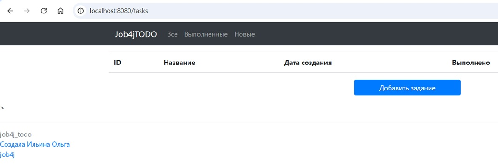
##### *Страница списка всех заданий ("основная")*
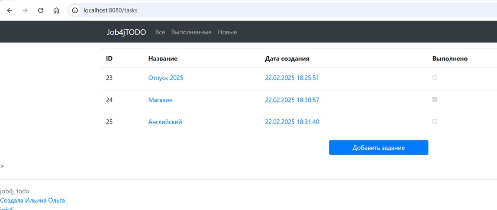
##### *Страница списка заданий со статусом "Новое"*
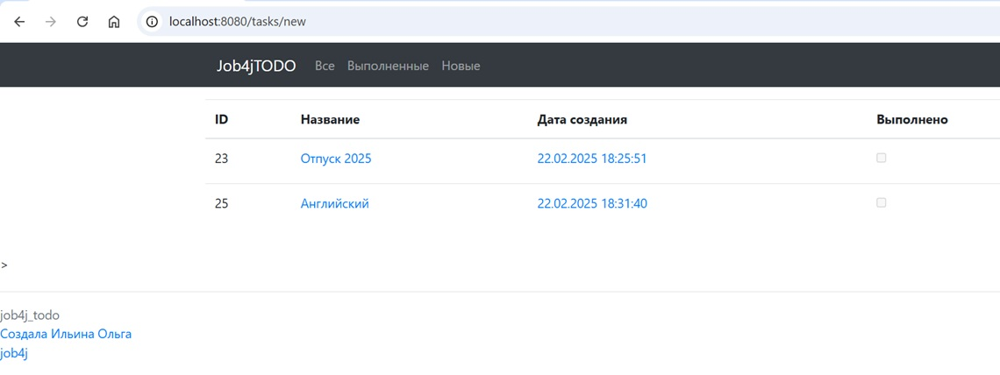
##### *Страница списка заданий со статусом "Выполнено"*

##### *Страница создания задания*
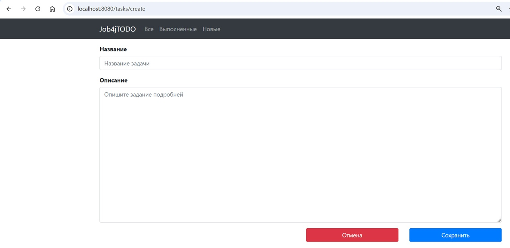
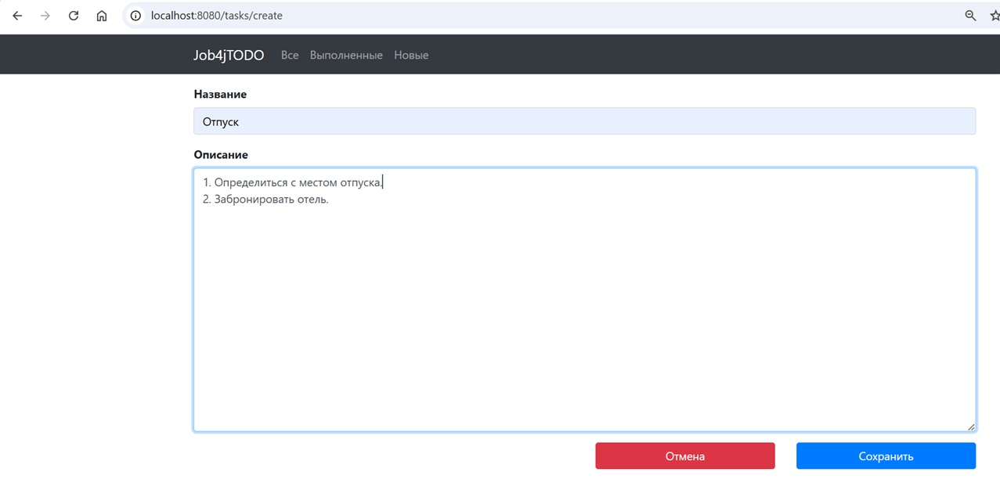
##### *Страница с сообщением об успешном создании задания*
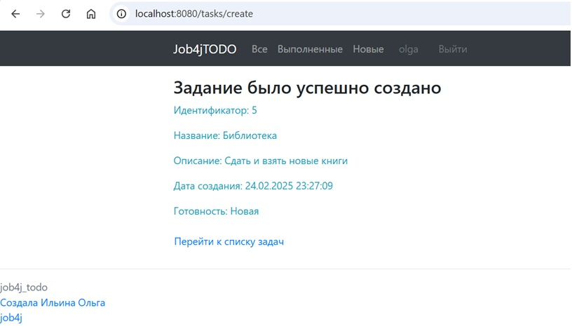
##### *Страница редактирования задания*

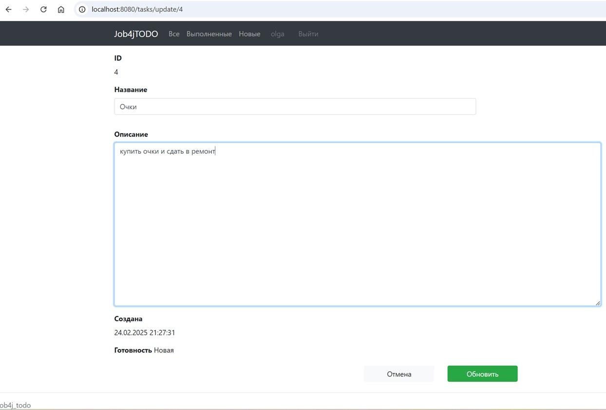
##### *Страница с сообщением об успешном обновлении задания*

##### *Страница с сообщением об успешном переводе задания в статус "Выполнено"*
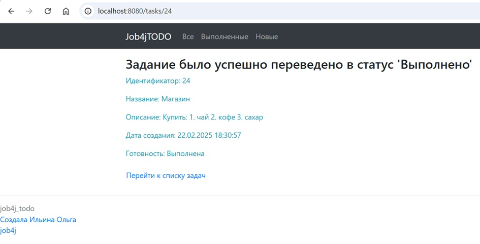
##### *Страница просмотра задания в статусе "Выполнено"* 
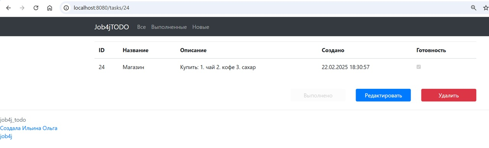
##### *Страница просмотра задания в статусе "Новое"*
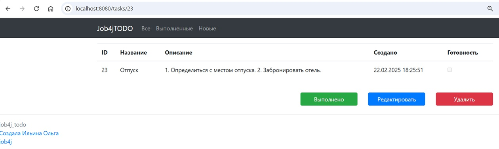
##### *Примеры страниц в результате неуспешной операции (например, сбои в БД)*
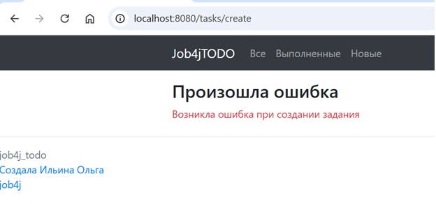
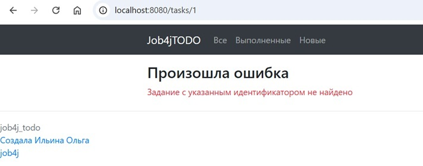

#### API
|          |                                        |                                                           |
|----------|----------------------------------------|-----------------------------------------------------------|
| CET      | /                                      | Основная страница                                         |
| CET      | /tasks                                 | Список всех заданий                                       |
| GET      | /create                                | Создание задания                                          |
| POST     | /create                                | Создание задания                                          |
| GET      | /tasks/{id}                            | Просмотр задания                                          |
| GET      | /tasks/update/{id}                     | Редактирование задания с идентификатором id               |
| POST     | /tasks/update/{id}                     | Редактирование задания с идентификатором id               |
| GET      | /tasks/done                            | Список всех заданий в статусе "Выполнено"                 |
| GET      | /tasks/new                             | Список всех заданий в статусе "Новое"                     |
| POST     | /tasks/delete/{id}                     | Удаление задания с идентификатором id                     |
| -------- | -------------------------------------- | --------------------------------------------------------- |
### Контакты

- Telegram: [@OlgaIlyina0312](https://t.me/OlgaIlyina0312)
- Email:    [oliljina@mail.ru](oliljina@mail.ru)
