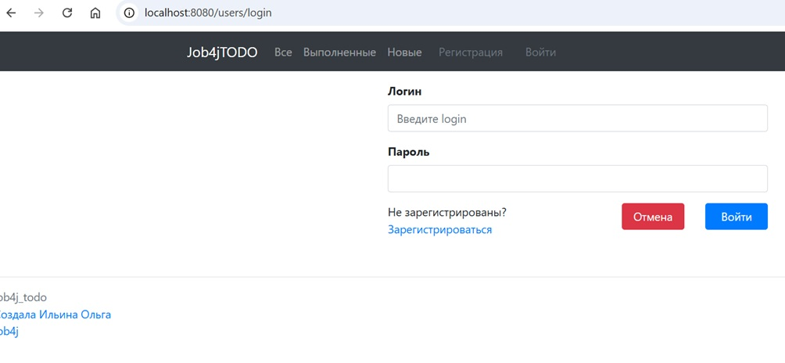
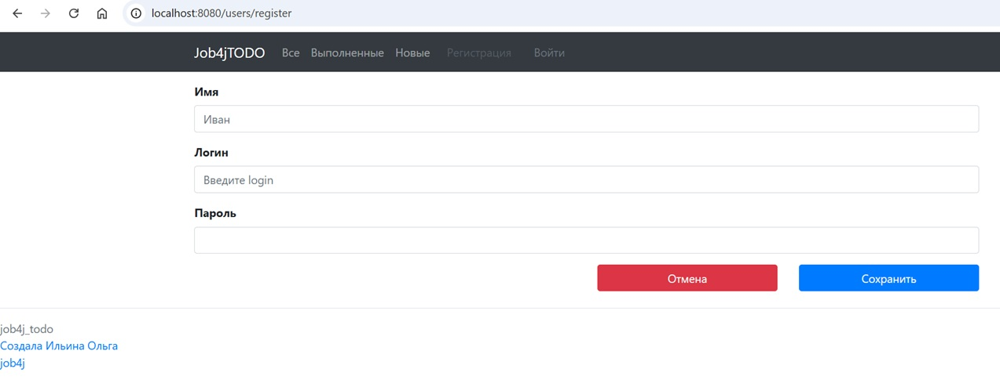
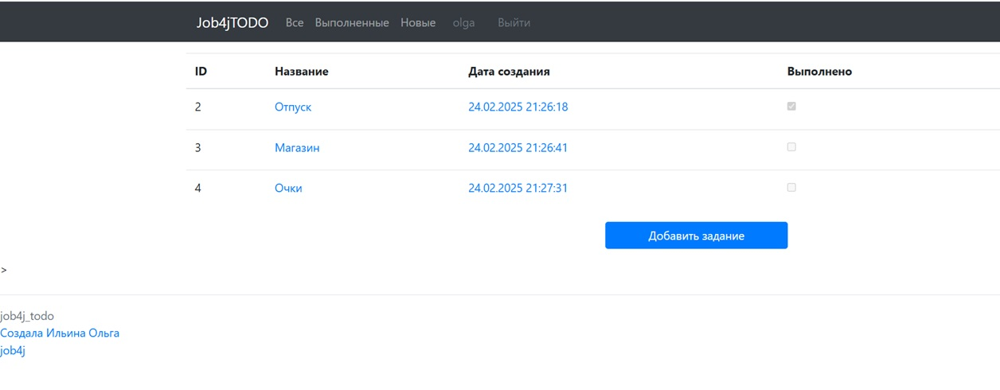
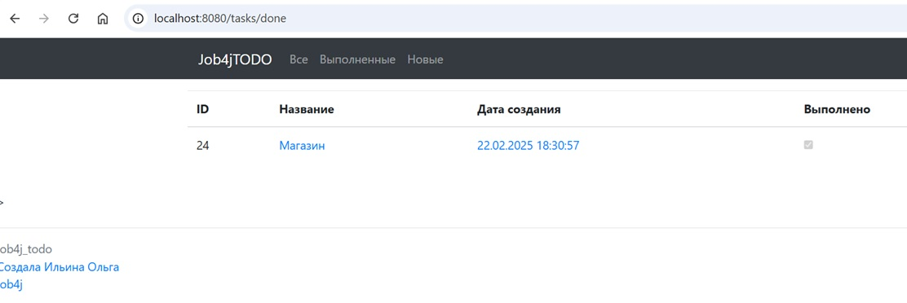
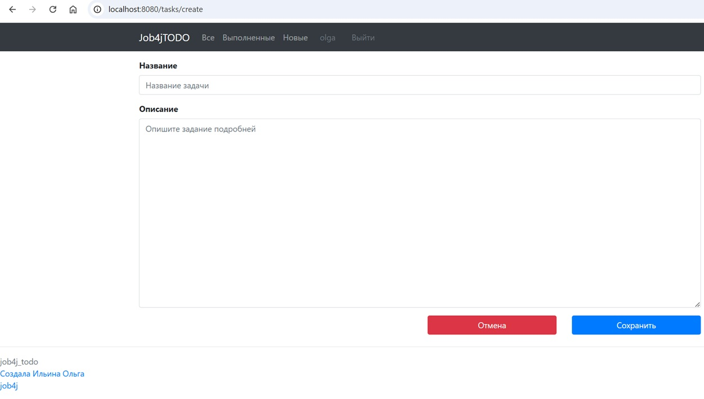
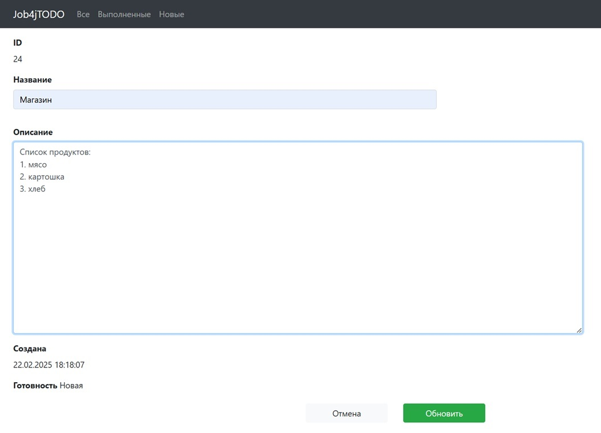
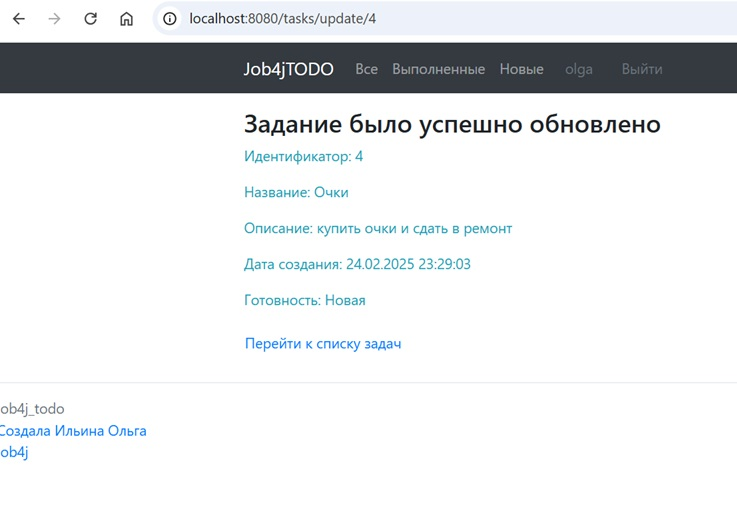
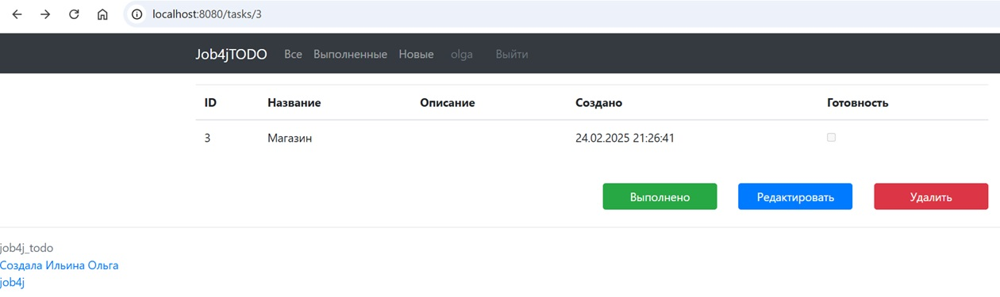

# job4j_todo

### Описание проекта "TODO список"

Данный проект - это веб-приложение, предоставляющее авторизованному пользователю возможность управления списком дел.

Система доступна только аутенифицированному пользователю:
первоначально пользователь попадает на страницу авторизации, где он может пройти аутентификацию путем ввода логина и
пароля.
Так же он может зарегистрироваться. При этом логин должен быть уникален: в системе не можем быть более одного
пользователя
с данным логином.
При неуспешной регистрации пользователь снова попадает на страницу регистрации, при этом выводится сообщение об ошибке.
При успешной авторизации пользователь может видеть и управлять списком дел. Также есть возможность разлогиниться.
При неуспешной авторизации пользователю снова предоставляется страница для ввода логина и пароля, на которой выводится
сообщение
об ошибке.

У задания есть название, описание, дата создания и статус: "Новое"/"Выполнено".
Пользователь может:

1. Совершать следующие действия над заданием:

- создавать новое задание (со страницы общего списка); задание создается со статусом "Новое"
- просматривать подробное описание
- удалять
- редактировать
- переводить задание со статусом "Новое" в статус "Выполнено"

2. выводить список:

- все задания
- выполненные
- новые

3. При успешном обновлении задания или переводе его в статус "Выполнено", на информационной странице об успешном
   выполнении
   операции есть ссылка перехода на основную страницу - "Все задания".
4. При успешном удалении задания происходит переход на основную страницу.
5. Операции удаления, перевода задания в статус "Выполнено" и "Удаление" доступны со страницы подробного описания
   задания.
6. Оперуция добавления доступна со страницы "Список всех задач".

### Стек технологий

Java 17, Spring Boot 3, Thymeleaf, Liquibase, Sql2o, PostgreSQL, Hibernate, MapStruct 1.5.5.Final

### Требования к окружению

Java 17, Maven 3.4.0, PostgreSQL

### Запуск проекта

``` create database cinema;  ```
``` mvn clean install  ```
и далее запускаем приложение

### Взаимодействие с приложением

#### Скриншоты

##### *Страница авторизации*



##### *Страница авторизации с сообщением о неуспешной авторизации*


##### *Страница регистрации*



##### *Страница регистрации с сообщением о неуспешной регистрации*


##### *Страница списка всех заданий (нет заданий в системе)*


##### *Страница списка всех заданий*



##### *Страница списка заданий со статусом "Новое"*


##### *Страница списка заданий со статусом "Выполнено"*



##### *Страница создания задания*




##### *Страница с сообщением об успешном создании задания*


##### *Страница редактирования задания*




##### *Страница с сообщением об успешном обновлении задания*



##### *Страница с сообщением об успешном переводе задания в статус "Выполнено"*


##### *Страница просмотра задания в статусе "Выполнено"*


##### *Страница просмотра задания в статусе "Новое"*



##### *Примеры страниц в результате неуспешной операции (например, сбои в БД)*


#### API

|      |                    |                                                                   |
|------|--------------------|-------------------------------------------------------------------|
| CET  | /users/login       | Авторизацияи                                                      |
| POST | /users/login       | Авторизация                                                       |
| CET  | /users/login       | Авторизацияи                                                      |
| CET  | /users/logout      | Выход из системы                                                  |
| POST | /users/register    | Регистрация                                                       |
| CET  | /                  | Основная страница - переадресация на страницу списка всех заданий |
| CET  | /index             | Основная страница - переадресация на страницу списка всех заданий |
| CET  | /tasks             | Список всех заданий                                               |
| GET  | /create            | Создание задания                                                  |
| POST | /create            | Создание задания                                                  |
| GET  | /tasks/{id}        | Просмотр задания                                                  |
| GET  | /tasks/update/{id} | Редактирование задания с идентификатором id                       |
| POST | /tasks/update/{id} | Редактирование задания с идентификатором id                       |
| GET  | /tasks/done        | Список всех заданий в статусе "Выполнено"                         |
| GET  | /tasks/new         | Список всех заданий в статусе "Новое"                             |
| POST | /tasks/delete/{id} | Удаление задания с идентификатором id                             |
|      |                    |                                                                   |

### Контакты


- Telegram: [@OlgaIlyina0312](https://t.me/OlgaIlyina0312)
- Email:    [oliljina@mail.ru](oliljina@mail.ru)
